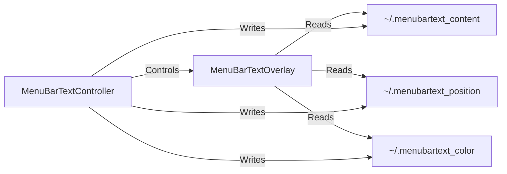

## Prerequisites

Before you begin, make sure you've completed the [installation](/installation) and have:

- MenuBarTextController running (quote bubble icon visible in menu bar)
- Menu bar set to auto-hide in System Settings

## Set your first custom text

<Steps>
  <Step title="Open the controller menu">
    Click the **quote bubble icon** in your menu bar.
  </Step>

  <Step title="Select 'Set Custom Text...'">
    A dialog will appear prompting you to enter your text.
  </Step>

  <Step title="Enter your text">
    Type any text you want to display. For example:
    
    - `"Code with confidence"`
    - `"You got this! 💪"`
    - `"Ship it! 🚀"`
    - `"Stay focused, stay awesome"`
    
    <Tip>
      MenuBarText supports full Unicode, so feel free to use emojis and special characters!
    </Tip>
  </Step>

  <Step title="Click 'Set Text'">
    Your text will appear immediately in the menu bar area when the menu bar is hidden.
    
    A confirmation dialog will show your updated text.
  </Step>
</Steps>

<Note>
  Your custom text is automatically saved to `~/.menubartext_content` and will persist across restarts.
</Note>

## Start the text overlay

If the text isn't visible yet, you may need to start the overlay:

<Steps>
  <Step title="Click the quote bubble icon">
    Open the MenuBarTextController menu.
  </Step>

  <Step title="Select 'Start Text'">
    This launches MenuBarTextOverlay.app, which displays your text.
    
    <Info>
      The overlay runs in the background without a dock icon. It's designed to be completely non-intrusive.
    </Info>
  </Step>

  <Step title="Hide your menu bar">
    Move your cursor away from the top of the screen to hide the menu bar.
    
    Your custom text should now be visible!
  </Step>
</Steps>

## Change text color

MenuBarText offers 4 color options to match your background and preferences.

<Steps>
  <Step title="Open the controller menu">
    Click the quote bubble icon.
  </Step>

  <Step title="Hover over 'Text Color'">
    A submenu will appear with color options:
    
    - 🟡 **Yellow** - Default bright option (works on most backgrounds)
    - ⚪ **White** - Perfect for dark backgrounds
    - 🔴 **Red** - High visibility for important reminders
    - 🟢 **Green** - Easy on the eyes for extended viewing
  </Step>

  <Step title="Select your preferred color">
    Click any color option. The change applies immediately - no restart needed.
  </Step>
</Steps>

<CodeGroup>
```bash Yellow (default)
echo "yellow" > ~/.menubartext_color
```

```bash White
echo "white" > ~/.menubartext_color
```

```bash Red
echo "red" > ~/.menubartext_color
```

```bash Green
echo "green" > ~/.menubartext_color
```
</CodeGroup>

<Tip>
  You can also change colors by directly editing the `~/.menubartext_color` file. The overlay checks this file every second and updates automatically.
</Tip>

## Adjust text position

Fine-tune where your text appears in the menu bar area.

<Steps>
  <Step title="Open the adjustment panel">
    Click the quote bubble icon → **"Open Adjustment Panel"**
    
    A small window will appear with position controls.
  </Step>

  <Step title="Use arrow buttons to move text">
    - **← Left** - Move text 10 pixels left
    - **Right →** - Move text 10 pixels right  
    - **↑ Up** - Move text 2 pixels up
    - **Down ↓** - Move text 2 pixels down
    
    Changes appear in real-time as you click.
  </Step>

  <Step title="Reset position if needed">
    Click **"Reset Position"** to return to the default location (x: 20, y: 5).
  </Step>

  <Step title="Close the panel">
    Click **"Close"** when you're satisfied with the position.
    
    <Info>
      You can reopen the adjustment panel anytime. The window stays open for multiple adjustments.
    </Info>
  </Step>
</Steps>

### Manual position editing

For precise control, edit the position file directly:

```bash
echo '{"x": 50, "y": 10}' > ~/.menubartext_position
```

<Note>
  Position coordinates:
  - **x**: Horizontal position from left (pixels)
  - **y**: Vertical position from top of menu bar (pixels, range: -10 to 20)
</Note>

## Control the overlay

Manage when the text overlay is running.

<Tabs>
  <Tab title="Start overlay">
    ```bash From menu bar
    Click quote bubble → "Start Text"
    ```
    
    Or manually:
    
    ```bash
    open /Applications/MenuBarTextOverlay.app
    ```
  </Tab>
  
  <Tab title="Stop overlay">
    ```bash From menu bar
    Click quote bubble → "Stop Text"
    ```
    
    Or using terminal:
    
    ```bash
    pkill -f MenuBarTextOverlay
    ```
  </Tab>
  
  <Tab title="Check status">
    ```bash
    pgrep -f MenuBarTextOverlay
    ```
    
    If running, you'll see a process ID number.
  </Tab>
</Tabs>

<Warning>
  The controller automatically enables/disables menu items based on overlay status. "Start Text" is only enabled when the overlay is stopped.
</Warning>

## Understanding the architecture

MenuBarText uses a two-app design for efficiency:



### How it works

1. **MenuBarTextController** provides the menu bar interface and writes settings to files
2. **MenuBarTextOverlay** reads these files every second and updates the display
3. Changes appear in real-time without restarting either app

### File monitoring

The overlay uses a timer-based file watcher (menubar_text.swift:78-105):

```swift
Timer.scheduledTimer(withTimeInterval: 1.0, repeats: true) { _ in
    // Check text changes
    let newText = self.loadCustomText()
    if self.label.stringValue != newText {
        self.label.stringValue = newText
    }
    
    // Check position changes
    let newPosition = self.loadPosition()
    // Update position if changed...
    
    // Check color changes
    let newColor = self.loadColor()
    if self.label.textColor != newColor {
        self.label.textColor = newColor
    }
}
```

## Common workflows

<AccordionGroup>
  <Accordion title="Daily motivation quotes">
    Set different quotes each day to keep your motivation fresh:
    
    ```bash
    # Monday
    echo "Start strong! 💪" > ~/.menubartext_content
    
    # Tuesday  
    echo "Progress over perfection" > ~/.menubartext_content
    
    # Wednesday
    echo "Halfway there! Keep going" > ~/.menubartext_content
    ```
  </Accordion>
  
  <Accordion title="Project-specific reminders">
    Display current sprint goals or project objectives:
    
    ```bash
    echo "Sprint 23: Ship user dashboard" > ~/.menubartext_content
    ```
    
    Update as you complete tasks or start new projects.
  </Accordion>
  
  <Accordion title="Focus mode">
    Use colors to indicate your current work mode:
    
    ```bash
    # Deep focus - red
    echo "🔴 Deep work - Do not disturb" > ~/.menubartext_content
    echo "red" > ~/.menubartext_color
    
    # Available - green
    echo "🟢 Available for collaboration" > ~/.menubartext_content  
    echo "green" > ~/.menubartext_color
    ```
  </Accordion>
  
  <Accordion title="Pomodoro timer reminder">
    Remind yourself to take breaks:
    
    ```bash
    echo "⏰ Take a break every 25 minutes" > ~/.menubartext_content
    ```
  </Accordion>
</AccordionGroup>

## Keyboard shortcuts

MenuBarTextController includes convenient keyboard shortcuts:

| Shortcut | Action |
|----------|--------|
| <kbd>⌘</kbd> + <kbd>S</kbd> | Start text overlay |
| <kbd>⌘</kbd> + <kbd>X</kbd> | Stop text overlay |
| <kbd>⌘</kbd> + <kbd>C</kbd> | Set custom text |
| <kbd>⌘</kbd> + <kbd>A</kbd> | Open adjustment panel |
| <kbd>⌘</kbd> + <kbd>Q</kbd> | Quit controller |

<Tip>
  These shortcuts work when the MenuBarTextController menu is open.
</Tip>

## Performance tips

MenuBarText is designed to be lightweight, but here are some best practices:

- **Keep text concise**: Shorter text uses less resources and is easier to read at a glance
- **Avoid frequent updates**: The 1-second polling interval is optimized for battery life
- **Use system colors**: The app uses native NSColor for efficient rendering

<Info>
  MenuBarText typically uses less than 25MB of RAM total (both apps combined) and has minimal CPU impact.
</Info>

## Next steps

Now that you're up and running:

<CardGroup cols={2}>
  <Card title="Basic usage" icon="book-open" href="/user-guide/basic-usage">
    Learn about menu bar controls and text management
  </Card>
  <Card title="Customization" icon="palette" href="/user-guide/customization">
    Explore color options and use cases
  </Card>
  <Card title="Position adjustment" icon="arrows-up-down-left-right" href="/user-guide/position-adjustment">
    Fine-tune text positioning with precision controls
  </Card>
  <Card title="Architecture" icon="sitemap" href="/reference/architecture">
    Understand how MenuBarText's dual-app system works
  </Card>
</CardGroup>