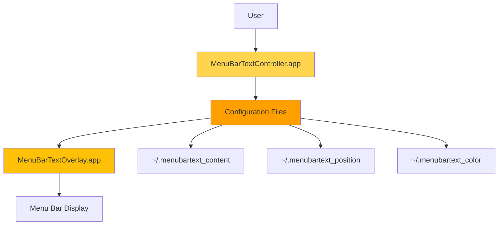

MenuBarText uses a lightweight dual-app architecture designed for efficiency and separation of concerns. The system consists of two independent macOS applications that communicate via file-based storage.

## Architecture overview



## Component breakdown

<CardGroup cols={2}>
  <Card title="MenuBarTextController" icon="gear">
    The control interface that runs in your menu bar
  </Card>
  <Card title="MenuBarTextOverlay" icon="window">
    The overlay window that displays your text
  </Card>
</CardGroup>

### MenuBarTextController.app

The controller provides the user interface for managing text overlay settings.

**Location:** `/Applications/MenuBarTextController.app`

**Key responsibilities:**
- Menu bar icon and interface (`menubar_text_controller.swift:11-16`)
- Start/stop overlay management
- Text input dialogs
- Color selection menu
- Position adjustment panel
- Process monitoring

**Window specifications:**
```swift
// Adjustment panel from menubar_text_controller.swift:151-156
adjustmentWindow = NSWindow(
    contentRect: NSRect(x: 100, y: 100, width: 300, height: 120),
    styleMask: [.titled, .closable, .miniaturizable],
    backing: .buffered,
    defer: false
)
```

### MenuBarTextOverlay.app

The overlay displays your custom text at the top of the screen.

**Location:** `/Applications/MenuBarTextOverlay.app`

**Key responsibilities:**
- Transparent overlay window
- Text rendering
- File watching (1-second polling)
- Real-time updates
- Auto-positioning

**Window configuration:**
```swift
// Window setup from menubar_text.swift:13-22
window = NSWindow(
    contentRect: NSRect(x: 0, y: screen.frame.height - menuBarHeight, 
                       width: screen.frame.width, height: menuBarHeight),
    styleMask: [.borderless], backing: .buffered, defer: false
)

window.isOpaque = false
window.backgroundColor = .clear
window.level = NSWindow.Level(rawValue: Int(CGWindowLevelForKey(.maximumWindow)))
window.ignoresMouseEvents = true
window.collectionBehavior = [.canJoinAllSpaces, .stationary]
```

## Communication mechanism

The two applications communicate through file-based storage, providing a simple and reliable inter-process communication method.

<Steps>
  <Step title="User action">
    User interacts with MenuBarTextController menu or dialog
  </Step>
  
  <Step title="File update">
    Controller writes changes to configuration files in home directory
  </Step>
  
  <Step title="Polling detection">
    Overlay polls files every 1 second for changes
  </Step>
  
  <Step title="Display update">
    Overlay updates text, color, or position immediately
  </Step>
</Steps>

### File watching implementation

```swift
// From menubar_text.swift:78-105
func startWatchingFiles() {
    Timer.scheduledTimer(withTimeInterval: 1.0, repeats: true) { _ in
        // Check text changes
        let newText = self.loadCustomText()
        if self.label.stringValue != newText {
            self.label.stringValue = newText
        }
        
        // Check position changes
        let newPosition = self.loadPosition()
        let currentFrame = self.label.frame
        if Int(currentFrame.origin.x) != newPosition.x || 
           Int(currentFrame.origin.y) != newPosition.y {
            self.label.frame = NSRect(
                x: CGFloat(newPosition.x), 
                y: CGFloat(newPosition.y), 
                width: self.window.contentView!.bounds.width - CGFloat(newPosition.x), 
                height: 20
            )
        }
        
        // Check color changes
        let newColor = self.loadColor()
        if self.label.textColor != newColor {
            self.label.textColor = newColor
        }
    }
}
```

<Info>
The 1-second polling interval provides near-instant updates while using minimal CPU resources.
</Info>

## Text rendering

### Label configuration

```swift
// From menubar_text.swift:29-35
label = NSTextField(labelWithString: customText)
label.textColor = color
label.backgroundColor = .clear
label.font = NSFont.systemFont(ofSize: 14, weight: .semibold)
label.alignment = .left
label.frame = NSRect(x: CGFloat(position.x), y: CGFloat(position.y), 
                    width: window.contentView!.bounds.width - CGFloat(position.x), 
                    height: 20)
```

**Typography:**
- Font: System font, 14pt, semibold weight
- Alignment: Left-aligned
- Height: Fixed at 20px
- Width: Dynamic based on screen width and X position

### Color mapping

```swift
// From menubar_text.swift:64-76
func loadColor() -> NSColor {
    let colorFilePath = NSHomeDirectory() + "/.menubartext_color"
    if let colorName = try? String(contentsOfFile: colorFilePath, encoding: .utf8)
        .trimmingCharacters(in: .whitespacesAndNewlines) {
        switch colorName {
        case "yellow": return .systemYellow
        case "white": return .white
        case "red": return .systemRed
        case "green": return .systemGreen
        default: return .systemYellow
        }
    }
    return .systemYellow
}
```

## Process management

### Auto-start configuration

The controller uses macOS LaunchAgent for automatic startup on login.

**Plist location:** `~/Library/LaunchAgents/com.menubartext.controller.plist`

```xml
<!-- From install.sh:83-102 -->
<dict>
    <key>Label</key>
    <string>com.menubartext.controller</string>
    <key>ProgramArguments</key>
    <array>
        <string>/Applications/MenuBarTextController.app/Contents/MacOS/MenuBarTextController</string>
    </array>
    <key>RunAtLoad</key>
    <true/>
    <key>KeepAlive</key>
    <true/>
    <key>ProcessType</key>
    <string>Interactive</string>
</dict>
```

<Note>
The `KeepAlive` key ensures the controller automatically restarts if it crashes.
</Note>

### Process control

```swift
// Start overlay - menubar_text_controller.swift:49-78
@objc func startTextOverlay() {
    let possiblePaths = [
        "/Applications/MenuBarTextOverlay.app",
        // Additional fallback paths...
    ]
    
    let task = Process()
    task.launchPath = "/usr/bin/open"
    task.arguments = [validPath]
    task.launch()
}

// Stop overlay - menubar_text_controller.swift:80-89
@objc func stopTextOverlay() {
    let task = Process()
    task.launchPath = "/usr/bin/pkill"
    task.arguments = ["-f", "MenuBarTextOverlay"]
    task.launch()
}
```

## Resource usage

MenuBarText is designed for minimal system impact:

| Component | RAM Usage | CPU Usage |
|-----------|-----------|-----------|
| Controller | ~15-20 MB | &lt;0.1% (idle) |
| Overlay | ~10-15 MB | &lt;0.1% (idle) |
| **Total** | **~25-35 MB** | **&lt;0.2%** |

<Tip>
The file polling system uses negligible CPU because it only activates once per second and performs simple file reads.
</Tip>

## Bundle structure

Both applications follow the standard macOS app bundle format:

```
MenuBarTextOverlay.app/
├── Contents/
│   ├── MacOS/
│   │   └── MenuBarTextOverlay          # Compiled binary
│   ├── Resources/                      # (Empty - no resources needed)
│   └── Info.plist                      # Bundle configuration

MenuBarTextController.app/
├── Contents/
│   ├── MacOS/
│   │   └── MenuBarTextController       # Compiled binary
│   ├── Resources/                      # (Empty - no resources needed)
│   └── Info.plist                      # Bundle configuration
```

### Info.plist keys

**Critical settings from install.sh:**

```xml
<key>LSUIElement</key>
<true/>  <!-- Hides dock icon -->

<key>LSMinimumSystemVersion</key>
<string>13.0</string>  <!-- Requires macOS 13.0+ -->

<key>CFBundleIdentifier</key>
<string>com.menubartext.overlay</string>  <!-- Or .controller -->
```

<Warning>
The `LSUIElement` key is essential - without it, both apps would show dock icons and interfere with normal workflow.
</Warning>
